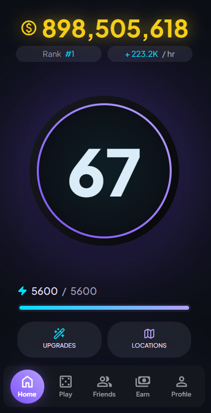
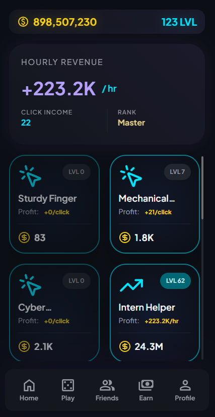
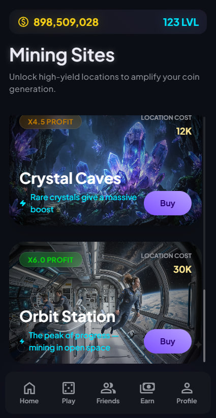
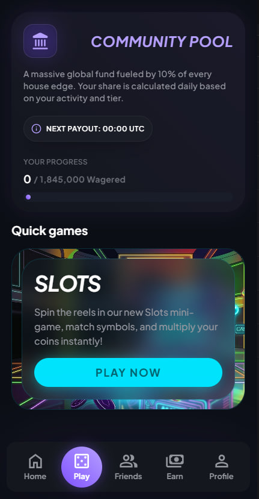
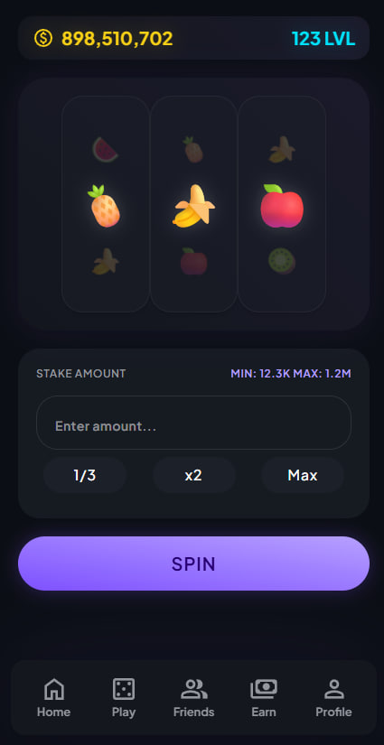
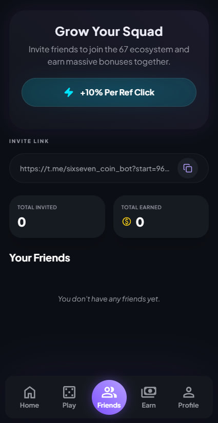
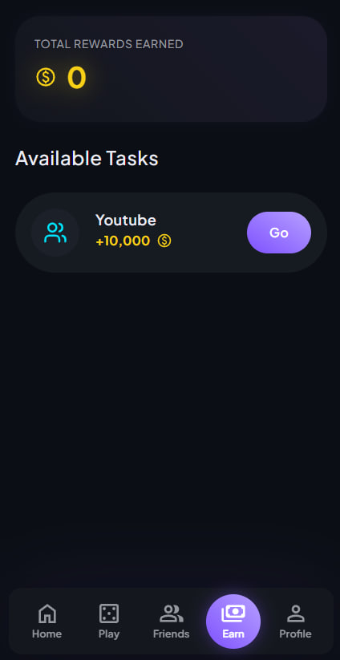
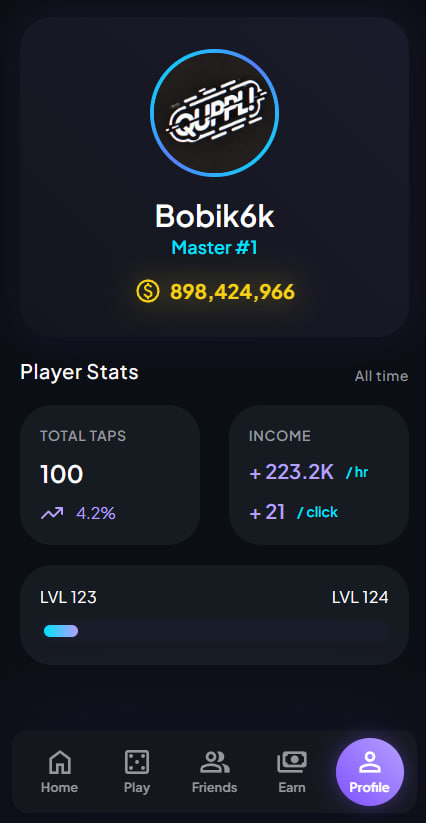

# 67 Coin

A Telegram Mini App idle clicker with a real in-game economy: weighted-odds slots, a community prize pool funded by house edge, exponentially-scaling upgrades, and a referral system with deferred payouts.

Built with FastAPI (async) + React, served entirely through a single nginx entrypoint so the frontend and API share one origin — no CORS, no split domains.

## A note on how this was built

I’d like to point out that I wrote this entire project by hand, figuring out each technology and solution as I went along. Throughout the development of this project, I actively used AI as an advisor or code reviewer. This project was designed to showcase my skills. Of course, as ironic as it may seem, this README, except for this paragraph,was written by a LLM, because I hate writing READMEs, sorry)

## Screenshots

| Home | Upgrades | Locations |
|---|---|---|
|  |  |  |

| Play / Community Pool | Slots | Friends |
|---|---|---|
|  |  |  |

| Earn | Profile |
|---|---|
|  |  |

## Why this project is interesting

Most tutorial-grade clickers are a button and a number. This one has an actual economy behind it:

- **Weighted slot machine.** Each spin draws from a table of symbols with individually tuned weights and pair/triple payout multipliers, not a flat random roll — so the house edge is a deliberate, tunable parameter rather than an accident.
- **Community Pool.** A percentage of every wagered coin is skimmed into a shared pool that pays out daily, proportional to each player's tracked activity — a soft incentive loop that rewards consistent engagement, not just spending.
- **Level-gated betting.** Minimum and maximum stake scale with player level, so early-game and late-game players are never playing the same game economically.
- **Exponential upgrade pricing.** Each purchased level of an upgrade multiplies the next purchase's cost (`cost × multiplier^count`), the standard idle-game curve, computed on the fly rather than stored per level.
- **Referral system with deferred bonuses.** Referral rewards accrue as a pending balance tied to the referred player's activity instead of paying out a flat one-time bounty on signup.
- **Real-time state over WebSocket.** Balance, energy and passive income are pushed to the client live instead of polled.

## Architecture

```
                         ┌────────────────────────┐
                         │        nginx           │  ← only container exposed to the internet
                         │  (reverse proxy + SPA) │
                         └──────────┬─────────────┘
                      ┌─────────────┴──────────────┐
                      │                            │
                  location /                   location /api/ (+ websocket upgrade)
                      │                            │
            ┌─────────▼─────────┐          ┌───────▼────────┐
            │  React SPA (dist) │          │   FastAPI API  │
            │  served as static │          │(async, uvicorn)│
            └───────────────────┘          └───────┬────────┘
                                                   │
                                          ┌────────▼──────────┐
                                          │   PostgreSQL      │
                                          │ (async SQLAlchemy)│
                                          └────────┬──────────┘
                                                   │
                                          ┌────────▼──────────┐
                                          │  Telegram Bot     │
                                          │    (aiogram)      │
                                          └───────────────────┘
```

- **Single entrypoint.** Everything goes through nginx on one origin — API calls are relative (`/api/...`), so there's no cross-origin request anywhere in production, which matters a lot inside the Telegram WebView.
- **Multi-stage frontend build.** The React app is compiled in a Node stage and only the static output is copied into the final `nginx:alpine` image — no Node.js in the production runtime, image stays lightweight.
- **Layered backend.** Requests flow through four independent layers, each with a single responsibility:

  ```
  api/handlers   → FastAPI routes: request/response only, no business logic
  api/schemas    → Pydantic request validation
  services/      → business logic (pricing, payouts, odds, XP curve)
  services/dto/  → typed response objects
  db/models.py   → SQLAlchemy models
  db/requests/   → all raw queries, isolated from business logic
  ```

  Business logic never touches the ORM session directly for querying — it goes through `db/requests`, which keeps the pricing/payout logic in `services/` testable independent of how data is fetched.
- **Rate limiting at the edge.** `nginx` enforces a request-rate limit per IP on `/api/`, so abusive traffic is rejected before it ever reaches the application or the database.

## Tech stack

**Backend** — Python, FastAPI, SQLAlchemy 2.0 (async) + asyncpg, PostgreSQL, Alembic, Pydantic v2, aiogram (Telegram bot), uvicorn.

**Frontend** — React 19, TypeScript, Vite, Tailwind CSS, React Router, Zod, Axios.

**Infrastructure** — Docker, Docker Compose, nginx (reverse proxy, static hosting, rate limiting, WebSocket proxying).

## Getting started

```bash
git clone https://github.com/FixbroYT/67-coin
cd 67-coin
cp .env.example .env
cp frontend/.env.example frontend/.env
# fill in .env: POSTGRES_*, HOST, PORT, PUBLIC_FRONT_URL, bot token, etc.

docker-compose up --build
```

The app will be available at `http://localhost/`, with the API under `http://localhost/api/` and interactive docs at `http://localhost/api/docs`.

## Project structure

```
backend/
  api/            FastAPI routers, handlers, request schemas
  services/       business logic and response DTOs
  db/             SQLAlchemy models and query layer
  migrations/     Alembic migrations
  main_api.py     API entrypoint
  main_bot.py     Telegram bot entrypoint
frontend/
  src/pages/      one folder per screen (Main, Upgrades, Locations, Play, Slots, ...)
  src/api/        API client
nginx/            reverse proxy config + multi-stage build for the frontend
docker-compose.yml
```
